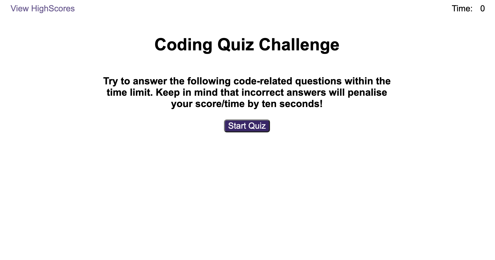
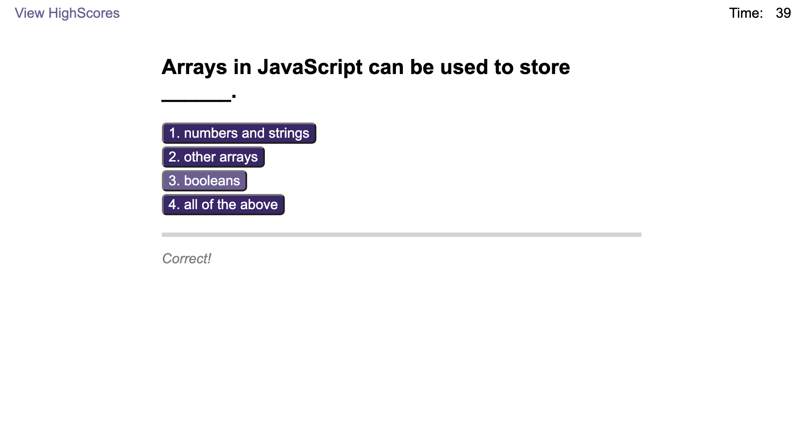
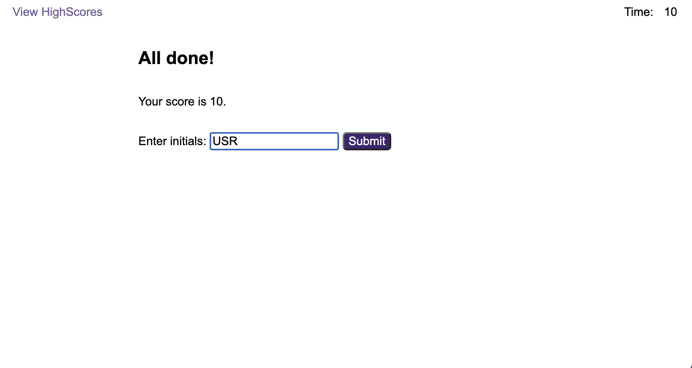
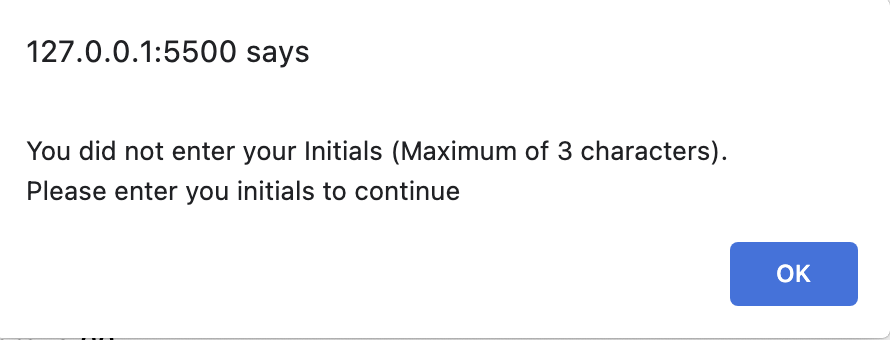
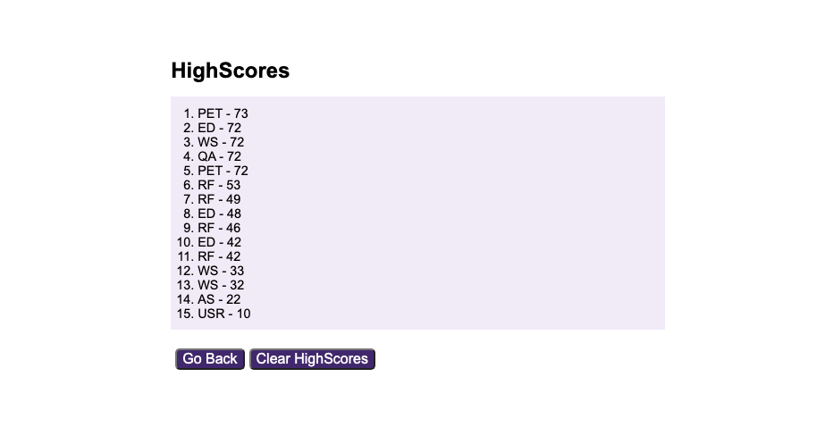
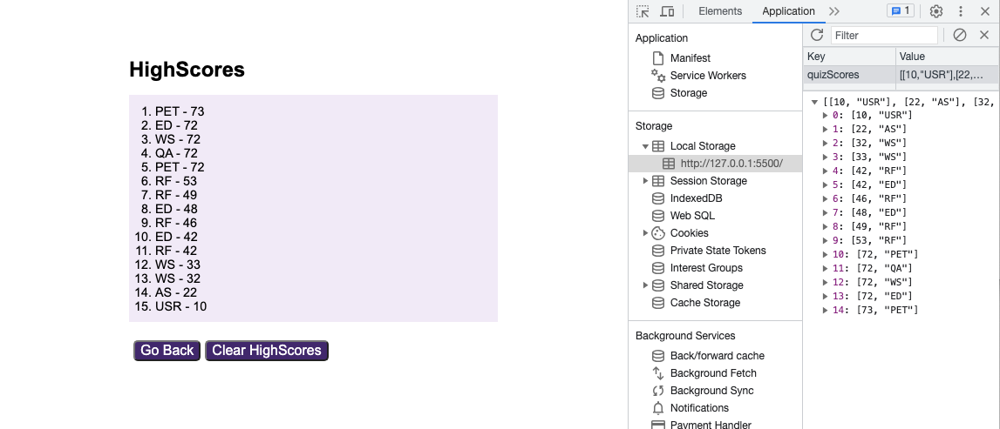

# 04-Web-APIs-Code-Quiz

## Description
The Code Quiz build and runs a quick multi-choice quiz to test knowledge of JavaScript APIs. The quiz will run for a maximum of 75 seconds. A 10 second time penalty is applied for incorrect answers.

The Quiz itself is quite straight forward and has 4 distinct phases:
1. Provides a brief introduction to the quiz. The quiz is started by clicking the Start Button. High Scores can be viewed by clicking the View Highscores link at the top left of the page
2. Loops through the quiz questions presenting a list of possible answers for each
3. Asks the user to enter their initials and record their score
4. Displays the list of scores, sorted from high to low after the user has entered their intials

The user can view the list of high scores at any time.

## Thinking Process & Structure
I've used snippets of Javascript in websites I've built in the past but not really understood what was happening.

I took this Challenge as an opportunity to develop my knowledge of the Web APIs and the DOM and decided to use JavaScript to build and run the entire quiz. It would be a chance to do more with JavaScript and explore its functionality and really see how it works.

The entire quiz, including the HTML, is built and constructed in Javascript. I had to do the analysis first to know what would be required and then build the layout in HTML. Once that was done I could work out how to implement the quiz in JavaScript.

The supplied GIF didn't show what happened when the Show HighScores link was clicked when a Quiz was running and what happened subsequently when the Go Back button was clicked. I handled that as if the history.back() method had been used. 

This ended up using a lot more of my time than I thought. While my inital analysis was correct I encountered unexpected issues with eventListeners and timers that had to be debugged. I had to change my approach on several occasions to get round problems. I learnt so much about the DOM, eventListeners, onclick events, timers functions and scope.

#### Note:
I wouldn't do this in a real project:
1. code maintenance would be expensive
2. too many opportinuties for error
3. debugging is time consuming 

It was a very useful exercise and I think well worth the time. 

## Data
Quiz questions, promptsandf answers are stored in an object in the separate quiz.js source file. This file also stores the timelengths - quiz duration, penalty time and message display time.

High Scores are stored in local storage in an array named quizScores. Each item in the quizScores array contains the score and intials for each recorded quiz score. The score and initials pairs are themselves 2 item arrays. The quizScores array is sorted by scores in the array items.  

I used a separate file to separate the data from the code so questions and quiz timings could be changed without having to modify the quiz code. Extra questions could be added too.

## Web APIs Code Quiz Website Link
Click the link to visit the deployed wbsite: [Web APIs Quiz][def1].

## Site Structure

The Web APIs Quiz is a JavaScript app with 4 phases that run in a single webpage.
1. Phase 1 - Introduction/Instructions
2. Phase 2 - Multiple Choice Quesions (currently 5 but not linited by the application)
3. Phase 3 - Score Recording
4. Phase 4 - Displaying/Managing the High Scores

## Navigation

#### Phase One - Introduction

#### Phase Two - Question 3

#### Phase Three - Score Recording

#### Phase Three - Erorr Message

#### Phase Four - Display HighScores

#### Phase Four - Local Storage - quizScores Array

## Changelog
The development history is recorded in the [Changelog](./CHANGELOG.md).

## Resources Used
1. Bootcamp Materials - Lesson Material from Week 4
2. Prior knowlege and experience
3. Group tutorial sessions
4. [MDM Web Docs][def2] addEventListener Method
5. [MDM Web Docs][def3] removeEventListener Method
6. [MDM Web Docs][def4] AbortSignal
7. [MDM Web Docs][def5] setInterval() global function
8. [MDM Web Docs][def6] Element:prepend() method
9. [MDM Web Docs][def7] Array.prototype.sort()

[def1]: https://dingogap.github.io/04-Web-APIs-Code-Quiz/
[def2]: https://developer.mozilla.org/en-US/docs/Web/API/EventTarget/addEventListener
[def3]: https://developer.mozilla.org/en-US/docs/Web/API/EventTarget/removeEventListener
[def4]: https://developer.mozilla.org/en-US/docs/Web/API/AbortSignal
[def5]: https://developer.mozilla.org/en-US/docs/Web/API/setInterval
[def6]: https://developer.mozilla.org/en-US/docs/Web/API/Element/prepend
[def7]:https://developer.mozilla.org/en-US/docs/Web/JavaScript/Reference/Global_Objects/Array/sort